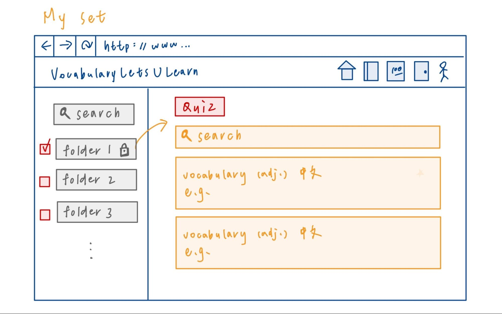
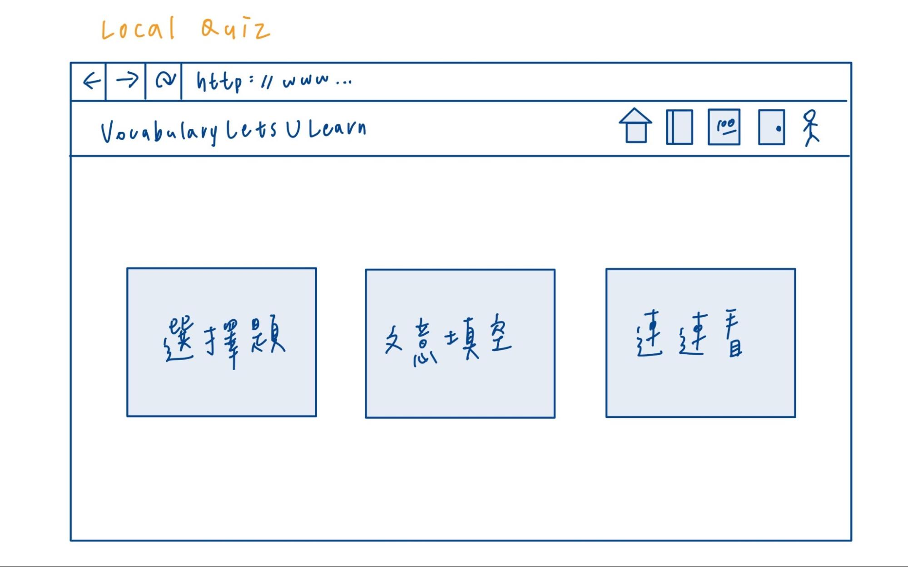
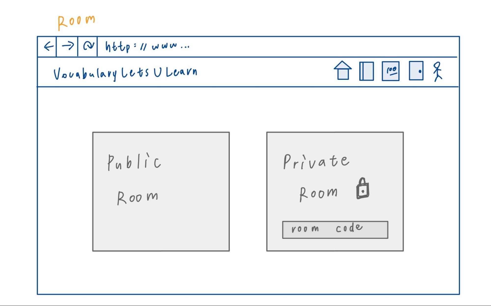
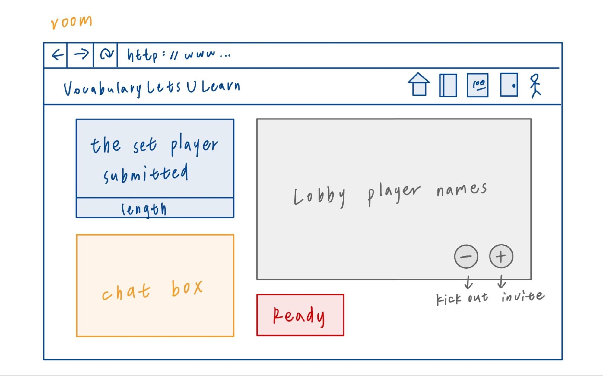
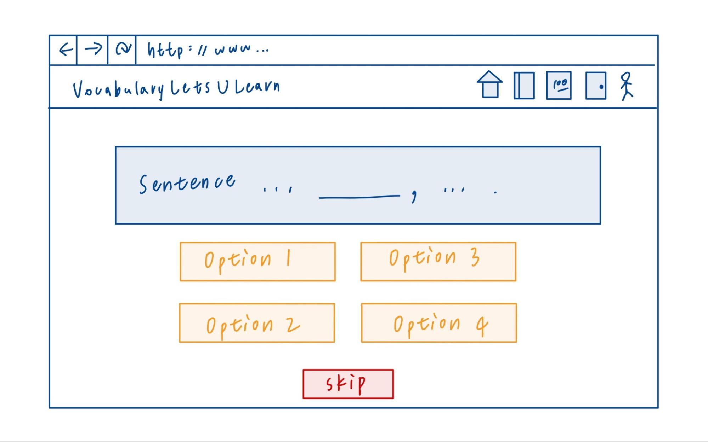
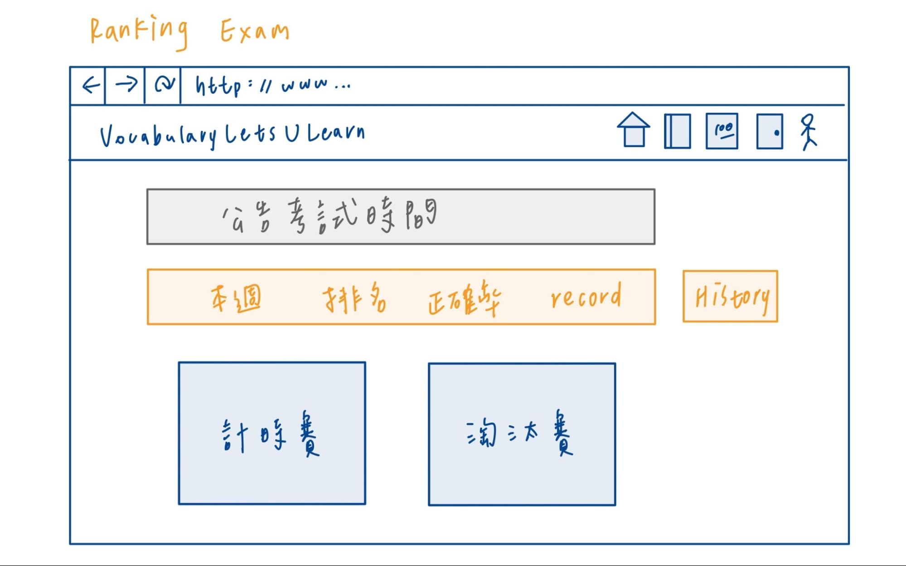
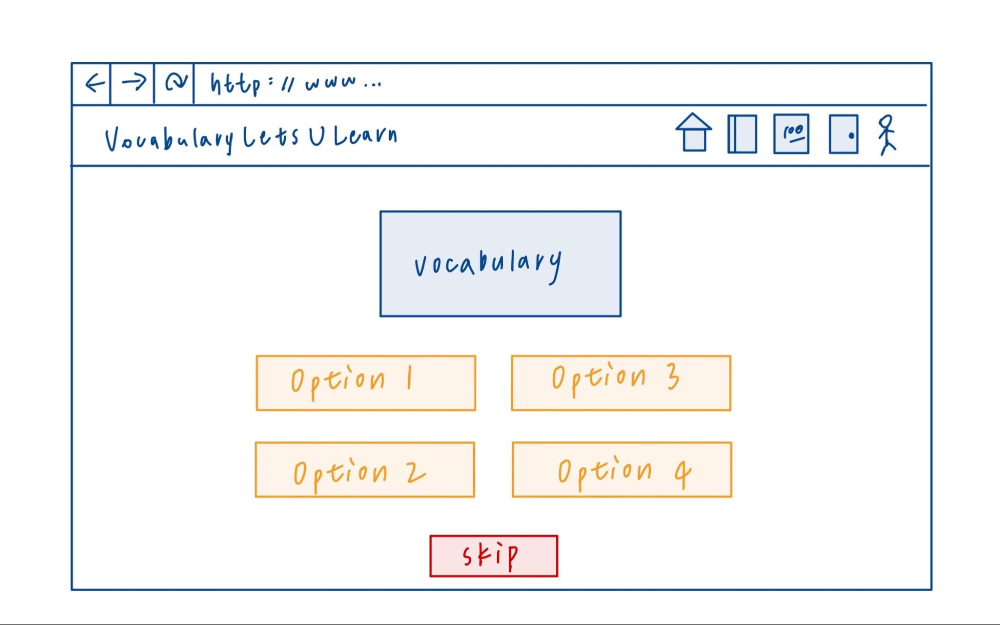
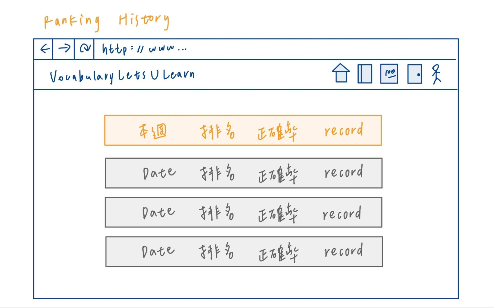
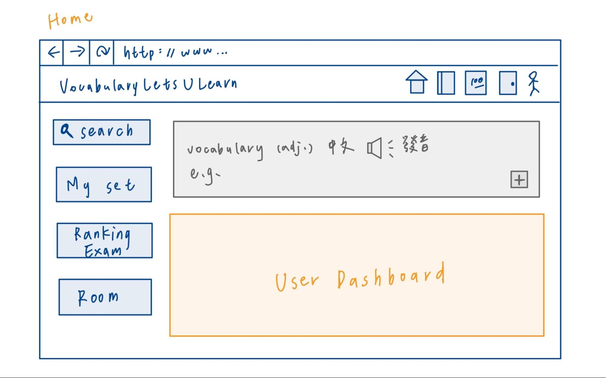
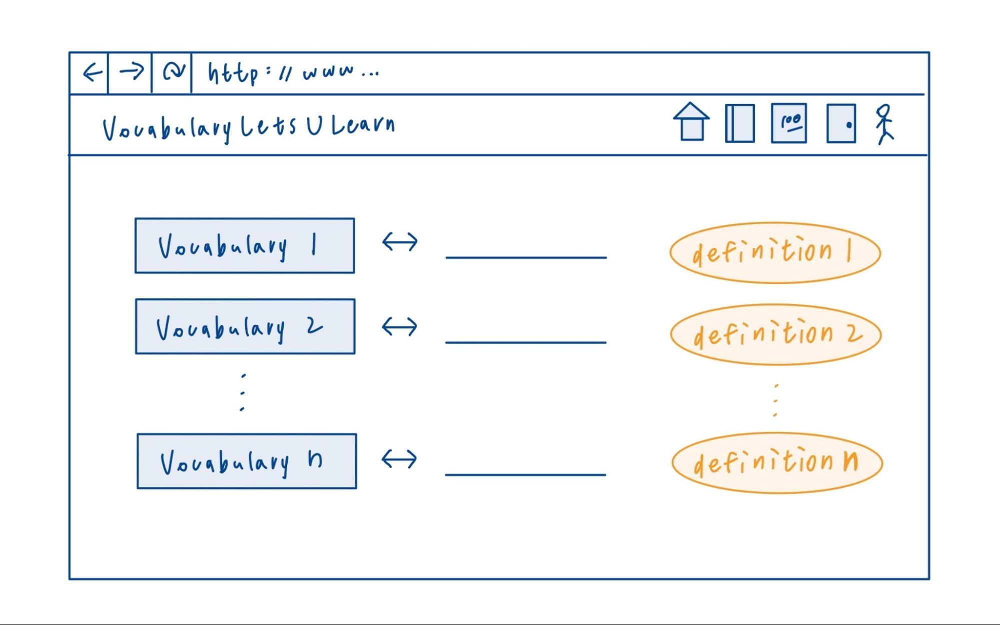

# 小組討論內容
* 專案題目
    * 題目： 
        - VocabularyLetUlearn
    * 畫面
    > 

    > 

    > 

    > 

    > 

    > 

    > 

    > 

    > 

    > 

    * 核心功能
        - 創建 set，裡面的單字 (key) 一旦被輸入須自動跳出其定義

        - 創建完 set 後，裡面的每個單字有以下功能
            - 例句
            - 發音
            - 能對該例句裡，使用者想要學的新單字放入該 set

        - 對於每個 set 有以下功能 
            - 查詢
                - Perfect matching
                - Prefix substr matching 
                - Postfix substr matching
                - Substr matching 
            - 排序
                - a~z
                - 按新增順序
                - 按答錯順序
                - 按長度順序
                - 按詞性順序

            - 能將想學的單字加入星號列

        - 帳號
            - 忘記密碼功能

            - 判斷合法 email 並寄發認證信

            - 使用者可透過  google 或 facebook登入

            - 阻隔機器人

            - 帳號間有好友關係

            - 聯絡人間可以形成 group

            - 每個帳號有 private 或 public 的 set, 使用者之間能看到 public 的 set，並將該 set 加入自己的帳號

            - 每個使用者都有自己的 calendar 可以記錄自己要做的事

            - Calender 能不能 @好友 將其加入行程，好友能被通知

        - 用戶追蹤
            - 追蹤每個使用者的 local 單字測驗情況、remote 測驗單字情況

            - 追蹤使用者的學習時間、上線時間、學習趨勢

        - 通知
            - 主畫面有 user dashboard （資料視覺化），包含以下內容：
                - 學習時間 

                - 常錯單字

                - 新增單字

                - Ranking

                - Rank 競賽次數

                - 非 rank 競賽次數

                - 總以學得單字數

                - 總單字數

            - 通知接到 gmail 等外部通訊

            - Web scheduling 提醒使用者上線
                - 使用者自定的行程
                - 系統的行程 e.g. rank test

        - 考試
            - Local quiz
                - 針對每個 set 測驗 set 裡面的單字（可給選項看是否要併入他人 public set 裡的單字）
                    - 選擇題

                    - 文意填空

                    - 連連看

                - 可 union、intersect 其他使用者的 set 

            - Ranking exam
                - 固定時間，有 ranking point

                - 單人模式

                - 計時賽，答題時間越快，正確率越高，分數也越高

                - 淘汰賽，名次越高，分數越高
                    - 避免分段差太多人進行比賽
                    - 主要加 ranking points 的方式

                - 如何handle disconnect

            - Party exam 
                - 不算分，可透過建立房間來與他人互動學習（能使用聯絡人 grouping 的功能）
                
                    - Private room
                        - 可透過朋友邀請進入

                        - 由房間內的用戶們提供自己的 set (可為 private set)

                        - 將set union起來做測試

                    - Public room
                        - 持有帳號之人皆可進入

                        - 房間內的用戶們提供自己的 set (可為 private set)

                        - 將 set union 起來做測試

                - 如何handle disconnect

        

* 技術
    * AWS, GitHub
    * 後端：
        - 程式語言：JavaScript
        - 版本：`v20.18.0`
        - 資料庫： MySQL
    * 前端：
        - 框架： React or Vue

* 團隊合作
    * 要採用的 Branching Model 是哪一種
        - Git flow

    * Trello 連結 
        - [113-1 Cloud System Design](https://trello.com/b/S9BqqEuP/113-1-cloud-system-design)

        - 我們想要怎麼用這個工具進行專案管理
            - 看板管理法

* 固定開會討論的時間
    - 每週三 20:00~21:00

* 這次討論中遇到的問題，以及你們是怎麼解決的？都沒有遇到問題，也可以寫沒有。
    - 專案功能和核心技術考慮不夠全面，如功能過於簡單、缺少實作要素
        - 解決辦法： 和老師討論改進方向、確認本次課程的要求

    - 專案功能細項繁多，目前還沒完全確定實現功能的技術
        - 分配可能使用到的技術查詢工作，並根據工作進度適時調整開會頻率
